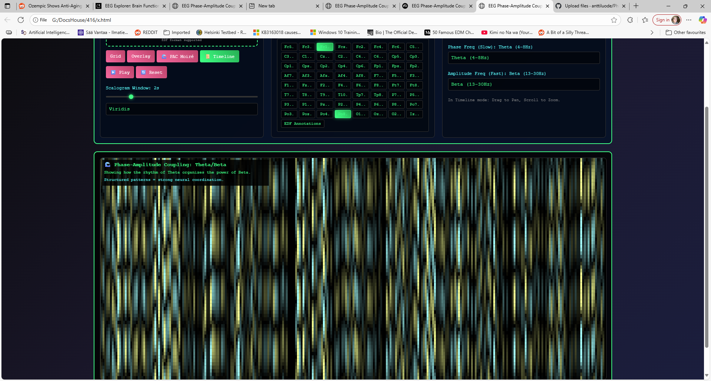

# 🧠 EEG Phase-Amplitude Coupling Explorer

An advanced, browser-based visualization tool for exploring Phase-Amplitude Coupling (PAC) in real EEG data. This explorer translates
the complex dynamics of neural synchrony into an intuitive, explorable visual landscape, revealing the intricate "texture" of brain activity over time.

This project moves beyond static charts, providing a fluid, real-time "temporal tapestry" of how slow brain rhythms organize the power of faster ones.

# ✨ Features

Four Visualization Modes:

Grid: View individual scalograms for multiple electrodes.

Overlay: Superimpose scalograms for direct comparison.

PAC Moiré: A real-time, full-screen snapshot of phase-amplitude coupling.

# 📜 Timeline: The flagship mode. Creates an ever-growing, historical landscape of PAC that you can pan and zoom through, even while paused.

Real-time Signal Processing: Loads standard EEG data (.edf format) and performs all filtering and analysis directly in your browser.

Interactive Controls:

Select specific frequency bands (Delta, Theta, Alpha, Beta, Gamma, High-Gamma) to analyze.

Easily select or clear groups of electrodes (Frontal, Parietal, All).

Intuitive playback controls, including play, pause, and reset.

High-Performance Rendering: Uses the HTML5 Canvas API to render smooth, high-resolution visualizations that can be navigated in real-time.

# 🚀 Quick Start Guide

This tool is a self-contained HTML file. No installation or servers are needed!

Save the Code: Save the provided code as a file named eeg_explorer.html (or any other .html name).

Open in Browser: Open the file in a modern web browser like Google Chrome or Mozilla Firefox.

Load Data: Click the "📁 Load Real EEG File" button and select an EEG data file in the .edf (European Data Format).

Select Electrodes: Once the file is loaded, the electrode buttons will appear. Click on individual electrodes or use the Frontal, Parietal,
or All buttons to make a selection.

Choose a Mode: Click the 📜 Timeline button for the most powerful visualization experience.

Analyze & Play: Use the "Moiré / Timeline Analysis" panel to select the slow (Phase) and fast (Amplitude) frequencies you want to investigate.
Press the ▶️ Play button.

# Explore!

Drag the mouse across the visualization to Pan left and right through the timeline.

Use the scroll wheel to Zoom in and out, revealing finer details or broader patterns.

# ⚠️ IMPORTANT MEDICAL DISCLAIMER ⚠️

This software is an experimental visualization tool intended for educational, artistic, and research purposes ONLY.
It is NOT a medical device. It has NOT been approved by the FDA or any other regulatory body. The data presented is a
creative and mathematical representation and should NEVER be used for:

Medical diagnosis of any kind.
Making treatment decisions.
Clinical monitoring.
Any other medical or therapeutic application.
Always consult with a qualified medical professional for any health concerns. Misinterpretation of the visualizations could 
lead to incorrect assumptions about health or brain function.
# 🙏 Credits & Acknowledgements

This project was Vibecoded by Claude / Gemini Pro 2.5

The conceptualization, feature refinement, and code implementation were developed in a creative partnership with large language models.
The iterative dialogue and coding assistance from Anthropic's Claude and Google's Gemini were instrumental in bringing this complex visualization to life.
